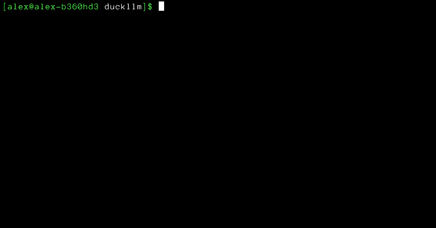
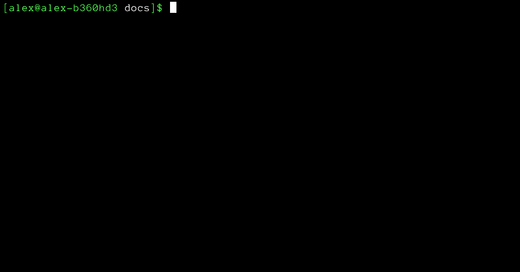
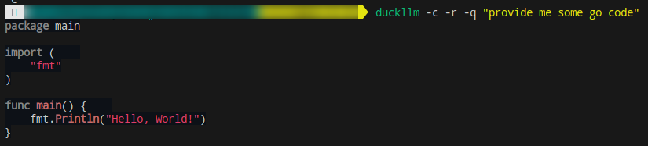
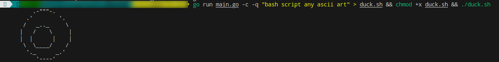
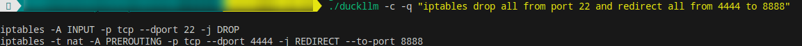

# What is it?
It is a simple console/terminal/cmd (not gui) client for [duckduckgo ai chat](https://duckduckgo.com/?q=DuckDuckGo+AI+Chat&ia=chat&duckai=1). No registration, no api keys, no sms. Just get and use.

# Installation

## Simple
Get binary from [releases](https://github.com/Brom95/duckllm/releases) page

## Pro way
1. `go install github.com/Brom95/duckllm@latest`
2. Don't forget to add folder with go binaries to `$PATH`

# Usage

App has several keys:

- `-m` string Model to use [gpt-4o-mini, mistralai/Mixtral-8x7B-Instruct-v0.1, meta-llama/Meta-Llama-3.1-70B-Instruct-Turbo, claude-3-haiku-20240307] (default "gpt-4o-mini")
- `-r` render output as markdown (or highlight code in non interactive `-c` mode). Output is more beautiful but without streaming. In interactive mode usually useless in case of copy/past.
- `-q` query to send in non interactive mode. Can be useful for quick info during terminal session.
- `-c` try provide  only code in non interactive mode. Useful to pipe output in file. 

## Interactive mode
After start you gonna see smth like:

Just insert you question and press return (enter) twice.

If render mode is on you can see smth like this:

That's all for know. In case of questions write me: [@brom_samedi](https://t.me/brom_samedi)

## Non interactive mode

You can use `-q` key (with or without `-c`) to get fast info from llm.

Use `-c` to try to provide only code:

or with `-r` flag:

also with `-c`:

# More examples:

Or more useful example:

